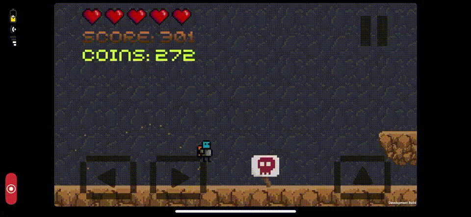

# Jumpy Jeb (January 2017 - December 2017)
2D Endless Runner iOS Game (Procedurally Generated)

: Built with Unity C# during Independent Study class in High School  
: First self-taught language & project  
: Developed strong troubleshooting skills & deeper understanding of OOP   

  

    
  

  
Regular Gameplay
 
  

    
  

  
Boss Battle 1
 
  

    
  

  
Boss Battle 2
 
  

    
  

  
Store to Upgrade The User
 

